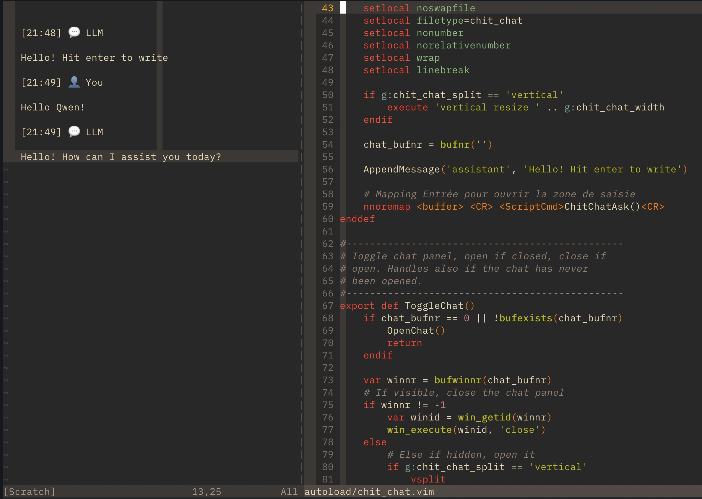

# vim9-ChitChat


**ChitChat** is a lightweight, pure **Vim9 plugin** that brings a chat interface directly into your editor.

While designed to run **locally** with [Ollama](https://ollama.com/) for complete privacy, it is fully compatible with any service supporting the **OpenAI API standard** (OpenAI, Mistral, Groq, LM Studio, etc.).

<p align="center">
  
</p>

## ✨ Features

*   **🌐 Local or Cloud:** Works out-of-the-box with **Ollama** (local/private), but easily configurable for **OpenAI**, **Mistral**, or **Groq**.
*   **⚡ Vim-Native:** Written in Vim9 script. Zero dependencies (no Python/Node.js, just `curl`).
*   **🧘 Distraction-Free:** Simple split view with a dedicated input buffer.
*   **🧠 Context-Aware:** Easily inject files or buffers into the conversation context (RAG-lite).
*   **🎭 Agent Personas:** Define different agents (e.g., Coder, Writer) with custom prompts.

## 📋 Prerequisites

*  **Vim 9.0+** (Required for Vim9 script support).
*  **curl** available in your path.
*  **[Ollama](https://ollama.com/)** (if running local models) or an API Key for a cloud provider.

## 📦 Installation

Using [vim-plug](https://github.com/junegunn/vim-plug):

```vim
Plug 'dpretet/vim9-ChitChat'
```

## ⚙️  Configuration

Add these variables to your .vimrc.

### 🏠 Local Setup (Ollama - Default)

By default, the plugin connects to a local Ollama instance.

```vim
" Ollama API endpoint
g:chit_chat_url = 'http://localhost:11434/api/chat'

" Model to use (must be pulled: `ollama pull qwen2.5-coder:3b`)
g:chit_chat_model = 'qwen2.5-coder:3b'

" No API key needed for local use
g:chit_chat_api_key = ''
```

### ☁️  Cloud Providers (OpenAI, Mistral, Groq...)

To use an online service, simply change the URL and add your API key.

Example: OpenAI

```vim
g:chit_chat_url = 'https://api.openai.com/v1/chat/completions'
g:chit_chat_model = 'gpt-4o'
g:chit_chat_api_key = 'sk-proj-xxxxxxxx....'
```

Example: Groq (Ultra-fast)

```vim
g:chit_chat_url = 'https://api.groq.com/openai/v1/chat/completions'
g:chit_chat_model = 'llama3-70b-8192'
g:chit_chat_api_key = 'gsk_xxxxxxxx....'
```

### 🎛️ General Settings

```vim
" Creativity (Temperature):
" 0.1 - 0.3 : Precise (Coding)
" 0.7       : Standard / Conversation
" 1.0+      : Creative / Brainstorming
g:chit_chat_temperature = 0.2

" Custom Agents / Personas
" Define predefined prompts to switch context easily
g:chit_chat_agent = {
    Isaac: {
        description: "You are an expert RTL and C developer.",
        temperature: 0.1,
        model: 'qwen2.5-coder:3b'
    },
    Writer: {
        description: "You are a creative technical writer.",
        temperature: 0.8,
        model: 'mistral'
    }
}
```

## 🚀 Usage

### 💬 Chat Management

```vim
:ChitChatOpen           " Open chat with default settings
:ChitChatOpen Isaac     " Open chat with the 'Isaac' agent profile
:ChitChatToggle         " Toggle the chat window visibility
:ChitChatClose          " Close the chat window (keeps history)
:ChitChatExit           " Exit and clear chat
```

### 🧠 Context Management

Give the LLM access to your code or files.

```vim
" Add files
:ChitChatAddFile ./src/main.c

" Add buffers
:ChitChatAddBuffer      " Add current buffer
:ChitChatAddBuffer %    " Add current buffer (alternative)
:ChitChatAddBuffer 5    " Add buffer number 5

" Manage Context
:ChitChatShowContext         " See what is currently in context
:ChitChatForget ./src/main.c " Remove a file from context
:ChitChatForgetAll           " Clear all context
```

### 📋 Helper Commands

Utilities to move code between your editor and the chat.

```vim
:ChitChatYank  " Yank current line or selection to internal clipboard
:ChitChatPaste " Paste the yanked text into the Chat Input
```

### ⌨️  Key Mappings (Input Window)

| Mapping | Action |
| :--- | :--- |
| **`Shift + Enter`** | **Send message** |
| **`Ctrl + Enter`** | **Send message** (Alternative) |
| **`Esc`** | Close the input window |


## 📜 License

MIT License
